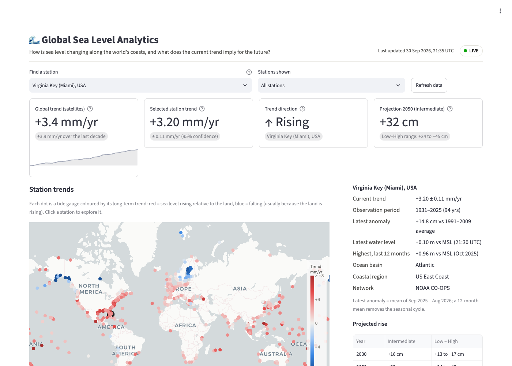

# 🌊 Global Sea Level Analytics

An interactive dashboard that answers one question:

> **How is sea level changing at different coastal locations, and what does the current trend imply for future coastal conditions?**

It combines ~500 tide gauges worldwide with the satellite record of global mean sea level and NOAA's 2022 sea-level-rise scenarios. Data is fetched live from public APIs every time the cache expires, so the numbers stay current without any manual updates.

**[▶ Open the live app](https://sea-level-analysis.streamlit.app/)** (it may take a moment to wake up if nobody has visited recently).



## What you can do

- **Explore the map.** Every tide gauge is coloured by its long-term trend (red = rising, blue = falling). Click a station, or search by name (try *Miami*, *Reykjavik* or *Tokyo*).
- **Read a station's story:**
  - its trend with 95% uncertainty and its observation period;
  - its latest 12-month anomaly;
  - for US stations, the live 6-minute water level and the highest water level of the past year.
- **Look ahead:**
  - US stations show NOAA's Low / Intermediate / High scenarios, with a toggle for all five, and observations overlaid so you can see which path the station is tracking.
  - International stations show a clearly labelled straight-line continuation of the trend.
- **Compare regions** by ocean basin or coastal region.
- **Download** the station table as CSV.

## Key indicators

| Indicator | Source |
|---|---|
| Global trend and acceleration (mm/yr, mm/yr²) | Satellite altimetry, 1993 to present |
| Station relative sea-level trend ± 95% CI | NOAA CO-OPS Sea Level Trends |
| Trend direction (only "Rising"/"Falling" when the CI excludes zero) | Derived |
| Latest anomaly vs 1991–2009 | NOAA monthly means |
| Latest and highest recent water level (US) | NOAA CO-OPS Data API, live |
| Projections for 2030 / 2050 / 2100 | NOAA 2022 Interagency scenarios |
| Stations monitored; stations rising and falling | Derived |
| Median trend by region | Derived |

## Running locally

```bash
python3 -m venv .venv
source .venv/bin/activate
pip install -r requirements-dev.txt
streamlit run app.py
```

Run the tests with `pytest`.

## How "live" works

| Data | Refresh |
|---|---|
| Station trends, satellite GMSL | Cached for 1 hour |
| Station monthly means | Cached for 1 hour |
| Latest water level, recent highs | Cached for 6 minutes |
| NOAA projections (static, 2022 report) | Cached for 24 hours |

The header shows when data was last fetched, plus a status pill:

- **● LIVE:** every source responded.
- **● SNAPSHOT:** a source failed and the app fell back to the bundled copy in `data/snapshot/`.

To refresh the snapshot, run `python scripts/refresh_snapshot.py`.

## Project layout

```
app.py                  Streamlit layout and interaction
slr/sources.py          HTTP access to NOAA / CU Boulder; retries and snapshot fallback
slr/transform.py        Pure analysis: parsing, baselines, anomalies, projections, GMSL fit
slr/regions.py          Rule-based ocean-basin and coastal-region assignment
slr/charts.py           Plotly figures
slr/theme.py            Light and dark colour tokens
scripts/refresh_snapshot.py
tests/                  Unit tests (no network needed)
```

## Methodology notes

- **Relative, not absolute.** Tide-gauge trends combine ocean rise with vertical land motion. That is what matters for flooding, but it explains why stations differ so much. Land still rebounding from Ice Age glaciers (Scandinavia, Alaska) shows *falling* sea level, while sinking coasts (Louisiana, Chesapeake Bay) show rates well above the global mean.
- **Different record lengths.** Trends span different periods (some start in the 1850s, many international records end around 2022), so compare them with that in mind.
- **Projections** are relative to NOAA's 2000 baseline (the 1991–2009 average). When a gauge ID has no projection, the app matches by coordinates, then by the nearest 1° grid cell.
- **Linear extrapolation**, used outside the US, ignores the acceleration seen in the satellite record, so it should be read as a lower-end reference, not a forecast.
- **Regions** are assigned by coordinate rules (see `tests/test_regions.py` for the boundary cases). They are approximate and meant only for aggregation.

## Data sources

- NOAA CO-OPS: [Sea Level Trends](https://tidesandcurrents.noaa.gov/sltrends/), [Data API](https://api.tidesandcurrents.noaa.gov/api/prod/), and the derived-product API used for projections.
- Permanent Service for Mean Sea Level (PSMSL): the international gauges, processed by NOAA.
- [CU Boulder Sea Level Research Group](https://sealevel.colorado.edu/): satellite GMSL (primary source).
- [NOAA Laboratory for Satellite Altimetry](https://www.star.nesdis.noaa.gov/socd/lsa/SeaLevelRise/): satellite GMSL (fallback). *Altimetry data are provided by NOAA Laboratory for Satellite Altimetry.*
- Sweet, W.V. et al. (2022). *Global and Regional Sea Level Rise Scenarios for the United States.* NOAA Technical Report NOS 01.
